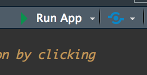
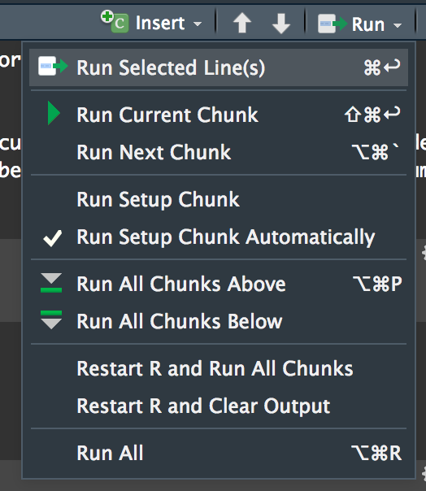

# Welcome to RStudio

The RStudio IDE (Interactive Development Environment) is the perfect place to
write your R code. Use this example project as a tool for exploring the
capabilities of R and RStudio.

## How to Use

When links are presented within the document, CTRL + Click (or Cmd + Click) on
the path to navigate to that file. For example, a [Shiny Application](./shiny-app/app.R).

## Types of Content

Most R users are familiar with "R scripts:" documents containing only
R code. While these are useful, there other useful types of content.

### Shiny Applications

Shiny applications are a popular way to build interactive web applications.
There is an [example Shiny application](./shiny-app/app.R) in this folder
for you to try! Navigate to the file and click "Run App" in the top right
corner.

### R Markdown Documents

This README is a R Markdown document. It is much like a markdown document,
except code is welcome! There is a 
[more typical RMarkdown document](./rmarkdown/analysis.Rmd) in this folder for
you to explore, as well.

Once you have opened an R Markdown document, you can either:

- "knit" the whole document. This runs all chunks and generates the final output

- "Run" code chunks individually. This runs each chunk interactively and shows the
output for only the executed code chunk

### R Notebooks

If you like the latter, interactive approach to R Markdown, then you might
appreciate [R Notebooks](./rnotebook/exploration.Rmd). 

R Notebooks are very much the same as R Markdown documents, except they "cache"
or "remember" the output of their code chunks. This makes them much more useful
for interactive exploration, but more troublesome for reproducibile analysis (in
the case that you forget to update a code chunk).

